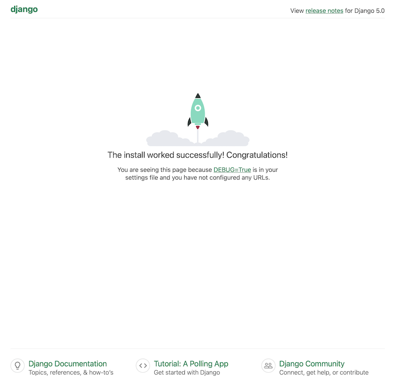
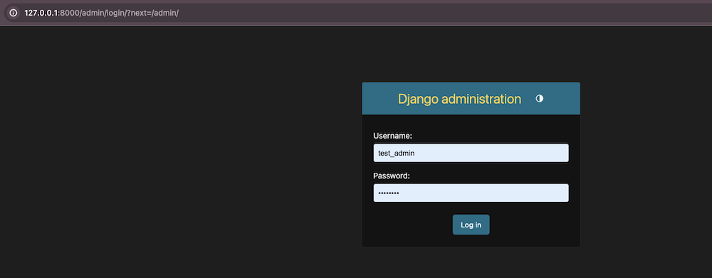
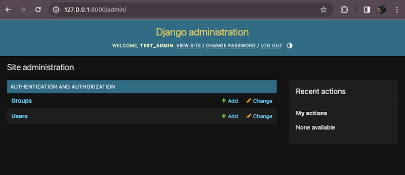
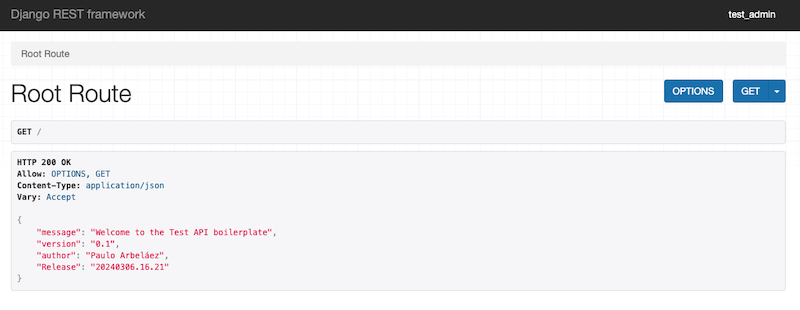
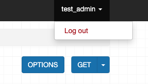

# django_boiler
 boilerplate for Django Projects

 ## Table of Contents

- [Introduction](#introduction)
- [Prerequisites](#prerequisites)
- [Instructions](#instructions)
    - [Setting up the project](#setting-up-the-project)
    - [Setting up the environment variables](#setting-up-the-environment-variables)
    - [Setting up the database](#setting-up-the-database)
    - [Setting up the acccess to the project](#setting-up-the-acccess-to-the-project)
    - [Setting up the external services](#setting-up-the-external-services)
    - [Setting up the cloud service (for file storage -images, videos, etc-)](#setting-up-the-cloud-service-for-file-storage--images-videos-etc-)
    - [Setting up the API](#setting-up-the-api)
    - [Create a basic API home view (optional)](#create-a-basic-api-home-view-optional)
    - [Setting up the authentication](#setting-up-the-authentication)
    - [JWT Authentication (optional)](#jwt-authentication-optional)
    - [Advanced Authentication (optional)](#advanced-authentication-optional)


## Introduction

This is a boilerplate for Django projects. It is a starting point for creating a new Django project with the following features:

- A virtual environment
- A PostgreSQL database
- A cloud service to store the files
- A REST API
- A JWT authentication system
- A basic authentication system
- A more advanced authentication system
- A basic view
- A Procfile file
- A requirements.txt file
- A .gitignore file
- A .env file
- A deployment to Heroku

## Prerequisites

- Python 3
- pip
- A cloud service to store the files (optional)
- A PostgreSQL database (optional)
- A Heroku account (optional)
- A GitHub account (optional)
- A Git repository (optional)
- A terminal

## Instructions

To use this boilerplate, you need to follow these steps:

### Setting up the project:

- Create a virtual environment:

    ```
    python3 -m venv .venv
    ```
- Activate the virtual environment:

    ```
    source .venv/bin/activate
    ```
- Install django:

    ```
    pip install django
    ```

- Create a new project:

    ```
    django-admin startproject project_name .
    ```
*Note: The dot at the end of the command is important. It tells Django to create the project in the current directory.*

*IMPORTANT:* to use this boilerplate, you need to delete the test_django folder and the manage.py file before running the startproject command.

- Test the project:

    ```
    python manage.py runserver
    ```

- Open the browser and go to http://127.0.0.1/8000

You should see the Django welcome page.



### Setting up the environment variables:

- Create a env.py file and add the following:

    ```
    import os

    os.environ['DATABASE_URL'] = 'your_database_url'
    os.environ['SECRET_KEY'] = 'your_secret_key'
    os.environ['DEBUG'] = 'True'
    os.environ['CLOUDINARY_URL'] = 'your_cloudinary_url'
    ```
*Note: The env.py file should not be committed to the repository.*

- Add the environment variables file to the settings.py file:

    ```
    import os

    ...

    if os.path.exists('env.py'):
        import env
    ```

- Change the secret key to use the environment variable:

    ```
    SECRET_KEY = os.environ['SECRET_KEY']
    ```

- Add the following to the settings.py file:

    ```
    DEBUG = os.environ['DEBUG']
    ```
*Note: This will allow you to use the DEBUG environment variable to configure the debug mode.*

### Setting up the database:

- Install the following packages:

    ```
    pip install dj_database_url
    pip install psycopg
    ````
The dj_database_url package allows you to use the DATABASE_URL environment variable to configure the database.
The psycopg package is a PostgreSQL adapter for Python.

- Add the following to the settings.py file:

    ```
    import dj_database_url

    DATABASES = {
        'default': dj_database_url.parse(os.environ.get("DATABASE_URL")),
    }
    ```
*Note: This will allow you to use the DATABASE_URL environment variable to configure the database.*

In this case, the production DB will be used right from the begining to confirm that everything is working as expected.

- Migrate the database:

    ```
    python manage.py makemigrations
    python manage.py migrate
    ```
*Note: This will create the database tables.*
In this case, the makemiogrations command is not necessary because we do not have any models or custom schemas, just the expected django ones.

- Create a superuser:

    ```
    python manage.py createsuperuser
    ```
*Note: This will allow you to access the admin panel.*

### Setting up the acccess to the project

- Change the allowed hosts so the app can run locally and on Heroku (or the cloud provider of your choice):

    ```
    ALLOWED_HOSTS = ['127.0.0.1/8000', 'localhost', '.herokuapp.com']
    ```

- Test the project:

    ```
    python manage.py runserver
    ```
Open the browser and go to http://127.0.01/8000/admin

You should see the Django admin login page.



Enter the superuser credentials and you should see the Django admin panel.



### Setting up the external services

- Install the following package:

    ```
    pip install gunicorn
    ```
The gunicorn package is a Python WSGI HTTP Server for UNIX. Basically what it does is to create a server that can handle the requests from the web and send them to the Django app.

- Create a requirements.txt file:

    ```
    pip freeze > requirements.txt
    ```
*Note: This will create a file with all the packages installed in the virtual environment. It will help the deployment service to know what packages are needed for the project to run properly.*

- Create a Procfile file:

    ```
    echo web: gunicorn project_name.wsgi:application > Procfile
    ```
*Note: This will create a file that tells Heroku how to run the project. In case of using a different provider, please read the documentation beforehand.*

### Setting up the cloud service (for file storage -images, videos, etc-)

For this example, we will use Cloudinary, a cloud-based image and video management service.

- Install the following packages:

    ```
    pip install cloudinary
    pip install django-cloudinary-storage
    pip install Pillow
    ```

The cloudinary package is a package that facilitates Django's usage of the files saved in this cloud service.

*Note: The cloudinary package is not necessary for the project to work, but it is a good practice to use a cloud service to store the files. If you would like to use a different one, then please read the documentation for that specific cloud and proceed as indicated there, not in this document.*

- Add the following to the settings.py file:

    ```
    ...

    # Cloudinary
    CLOUDINARY_STORAGE = {
        'CLOUDINARY_URL': os.environ.get('CLOUDINARY_URL')
    }
    MEDIA_URL = '/media/'
    DEFAULT_FILE_STORAGE = 'cloudinary_storage.storage.MediaCloudinaryStorage'

    INSTALLED_APPS = [
        ...
        'django.contrib.messages', # Already in the file
        'cloudinary_storage',
        'django.contrib.staticfiles', # Already in the file
        'cloudinary',
        ...
    ]
    ```
*Note: This will allow you to use the CLOUDINARY_URL environment variable to configure the cloudinary service.*

---
**Until here, the project is ready to be deployed to Heroku. The next steps are to add JWT, create a Heroku app and deploy the project to it.**

**Also, to create apps inside this boiler plate, please refer to my previous Django projects.**

---

From here on, we will continue creating an API for the project by using the Django REST framework.

### Setting up the API

- Install the following packages:

    ```
    pip install djangorestframework
    pip install django-cors-headers
    ```
The djangorestframework package is a powerful and flexible toolkit for building Web APIs.
The django-cors-headers package is a Django application for handling the server headers required for Cross-Origin Resource Sharing (CORS).

- Add the following to the settings.py file:

    ```
    INSTALLED_APPS = [
        ...
        'rest_framework',
        'corsheaders',
    ]
    ```

- Add the following to the settings.py file:

    ```
    MIDDLEWARE = [
        'corsheaders.middleware.CorsMiddleware',
        ...
    ]
    ```
*Note: This will allow the server to handle the server headers required for Cross-Origin Resource Sharing (CORS).*

IMPORTANT: The order of the middleware is important. The CorsMiddleware should be placed as high as possible, especially before any middleware that can generate responses such as Django's CommonMiddleware or Whitenoise's WhiteNoiseMiddleware.

- Add the following to the settings.py file:

    ```
    CORS_ORIGIN_ALLOW_ALL = True
    ```
*Note: This will allow the server to accept requests from any origin.*

### Create a basic API home view (optional)

This step is not necessary, but it is a good practice to create a basic view to test the API and to know what api are you accessing, the version, etc.

- Create a home view

You must create a views.py file in the porject folder:

    ```
    touch ./project_name/views.py
    ```

Add the following to the views.py file:

    ```
    from rest_framework.decorators import api_view
    from rest_framework.response import Response


    @api_view()
    def root_route(request):
        return Response({
            your message here
        })
    ```

And then add the following to the urls.py file:

    ```
    from django.urls import path
    from . import views

    urlpatterns = [
        path('', views.root_route, name='root_route'),
    ]
    ```

With this view, you can test the API by going to http://127.0.0.1/8000/



### Setting up the authentication

- Setup the authentication

As DRF comes with a default authentication system, you can use it out of the box.

Add the following to the settings.py file:

    ```
    REST_FRAMEWORK = {
        'DEFAULT_AUTHENTICATION_CLASSES': [
            'rest_framework.authentication.BasicAuthentication',
            'rest_framework.authentication.SessionAuthentication',
        ],
        'DEFAULT_PERMISSION_CLASSES': [
            'rest_framework.permissions.IsAuthenticated',
        ],
    }
    ```

...and add the url to the urls.py file:

    ```
    from django.urls import path, include

    ...
    path('api-auth/', include('rest_framework.urls')),
    ```

Now you should have the authentication system working, and it can be seen in the browsable API, with the login and logout options.



### JWT Authentication (optional)

- If you want to use JWT authentication, you can install the following package:

    ```
    pip install dj-rest-auth
    pip install djangorestframework_simplejwt
    ```

dj-rest-auth is a package that provides a set of REST API endpoints for authentication, registration, and account management.
djangorestframework_simplejwt is a package that provides a JSON Web Token authentication for Django REST framework.

- Add the app to the INSTALLED_APPS list in the settings.py file:

    ```
    INSTALLED_APPS = (
        ...,
        'rest_framework',
        'rest_framework.authtoken',
        ...,
        'dj_rest_auth'
    )
    ```

- Add the urls to the urls.py file:

    ```
    ...
    path('dj-rest-auth/', include('dj_rest_auth.urls'))
    ```

- Migrate the database:

    ```
    python manage.py migrate
    ```

### Advance Authentication (optional)

- If you want to use a more advanced authentication system, you can install the following package:

    ```
    pip install django-allauth
    ```

Django Allauth is a flexible authentication app that can be used to add social authentication to the project.
Also, it can be used to add email confirmation, password reset, and other features.

More info at: https://docs.allauth.org/en/latest/introduction/index.html

- Add the app to the INSTALLED_APPS list in the settings.py file:

    ```
    INSTALLED_APPS = (
        ...,
        'allauth',
        'allauth.account',
        'allauth.socialaccount',
        ...
    )
    ```
